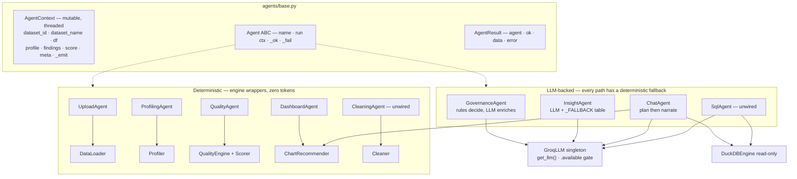
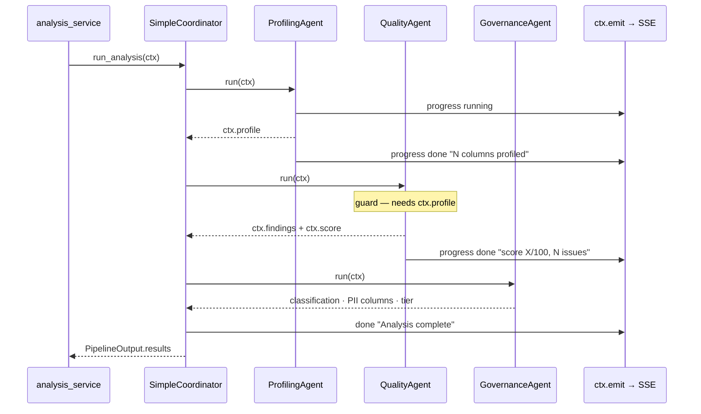
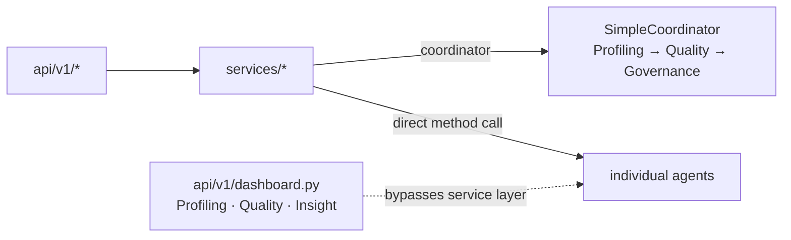
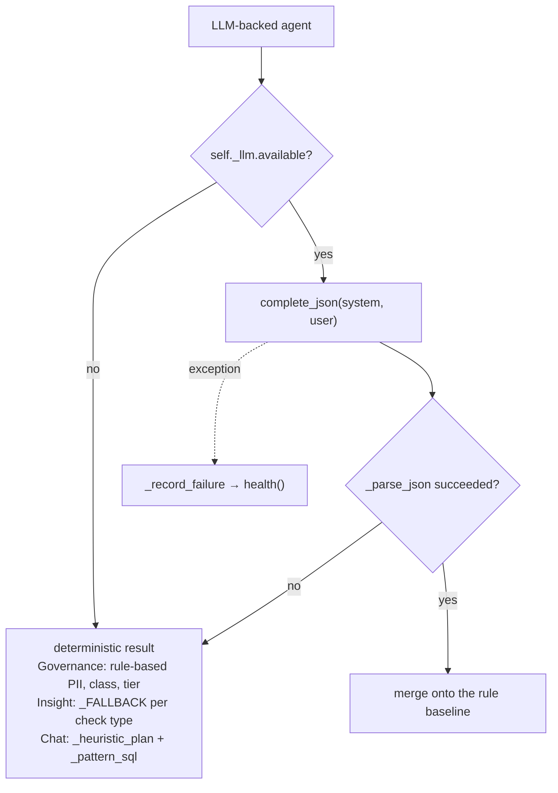

# DataPilot AI — Architecture

This document covers the agent design as required for submission: the **agent node
diagram**, **state management approach**, **human-in-the-loop (HITL) gate design**,
**tool registry**, and **memory strategy**. For the full system design (DB schema,
API surface, folder layout) see [../ARCHITECTURE.md](../ARCHITECTURE.md).

---

## 1. Overview

DataPilot AI is a **deterministic-core, AI-assisted** agent. The heavy lifting
(profiling, quality checks, scoring, cleaning, SQL execution) runs in deterministic
Python engines; a Groq LLM adds the language/reasoning layer (explanations,
NL→SQL, NL→rule, narration, classification text). Every LLM path has a
deterministic fallback, so the agent degrades gracefully when the model is
rate-limited or offline.

```
Browser (React SPA)
      │  HTTPS  /api/v1/*
      ▼
FastAPI  ──►  Service layer  ──►  Repository layer  ──►  SQLite (metadata)
                   │                                     Parquet files (row data)
                   ├──► Engines  (Pandas · NumPy · DuckDB · ReportLab · OpenPyXL)
                   └──► Agents   (Groq LLM) + SimpleCoordinator
```

---

## 2. Agent node diagram

All agents implement one contract in `agents/base.py` — `run(ctx) -> AgentResult` —
and communicate only by reading and enriching a single mutable `AgentContext`. They
never call each other.

Agents are reached two ways: `SimpleCoordinator` sequences three of them as the
analysis pipeline, and services call the rest **directly** via purpose-built methods
(`.load()`, `.classify()`, `.build()`, `.ask()`, `.explain_issues()`). The direct
path is the more common one.

> The mermaid sources below render inline on GitHub and in VS Code preview. PNG
> exports for slides/submission are in [`diagrams/`](diagrams/):
> [contract](diagrams/agents-1-contract.png) ·
> [pipeline](diagrams/agents-2-pipeline.png) ·
> [invocation paths](diagrams/agents-3-paths.png) ·
> [LLM degradation](diagrams/agents-4-degradation.png)

### 2a. Contract and agent families



`ProfilingAgent` is the universal prerequisite: `QualityAgent`, `GovernanceAgent`,
`DashboardAgent` and `CleaningAgent` all guard on `ctx.profile is not None` and fail
fast without it, so seven different callers construct it.

### 2b. Analysis pipeline — `SimpleCoordinator`, three agents



`UploadAgent` is **not** in the pipeline — `DatasetService` runs it at upload time to
produce the DataFrame the pipeline then consumes. Custom validations and user
exclusions are applied by the service layer after the pipeline, each triggering a
re-score.

Each `agent.run()` is individually wrapped in `try/except`: a crash becomes
`AgentResult(ok=False, error=...)` plus an error progress event, and the run
continues. One agent cannot kill the pipeline.

`InsightAgent` is **deliberately kept out** of the pipeline
(`orchestrator.py`): per-issue explanations are deterministic and business insights
are generated on demand by the Insights tab, so analysis stays fast and token-free —
it re-runs on every fix and edit.

The `Coordinator` Protocol exists so a CrewAI/LangGraph implementation can be
swapped in without touching the service layer.

### 2c. Invocation paths



| Caller | Agents constructed |
|--------|--------------------|
| `dataset_service` | Upload |
| `analysis_service` | **coordinator** + Profiling, Governance |
| `governance_service` | Profiling, Quality, Governance |
| `dashboard_service` | Profiling, Dashboard |
| `chat_service` | Profiling, Chat |
| `custom_validation_service` | Profiling |
| `ai_service` | Profiling + `get_llm()` directly |
| `api/v1/dashboard.py` | Profiling, Quality, Insight — skips the service layer |

`analysis_service` is the only caller that uses the coordinator.

### 2d. Interactive agents (per user action)

```
Chat message ─► [ChatAgent] ── plan ──► converse ─► narrated answer
                     │           │
                     │           └────► SQL (DuckDB, read-only) ─► table + auto chart + narration
                     └─ deterministic fallback (pattern-SQL) if LLM unavailable/deflects

"add validation" ─► [CustomValidationService] ─► LLM proposes condition ─► preview (count+sample)
                                                   ─► HUMAN APPROVES ─► persisted as a live check

widget "Explain this" ─► [AiService.explain] ─► LLM (or deterministic summary)
```

### 2e. LLM degradation



Governance computes classification, PII columns and tier from rules **first** and
lets the LLM add only column descriptions and rationale, so an LLM outage never
changes a compliance decision.

### 2f. Unwired agents

`SqlAgent` and `CleaningAgent` are fully implemented but have **no references outside
`app/agents/`**. `CleaningService` uses the `Cleaner` engine directly, and NL→SQL is
handled by `ChatAgent`'s own planner rather than by `SqlAgent`. Both should be wired
in or removed.

---

## 3. State management approach

- **Request/analysis state — `AgentContext`** (`agents/base.py`): a single mutable
  object threaded through the pipeline. Each agent reads prior fields and writes its
  own (`profile`, `findings`, `score`, `meta[...]`). This keeps agents decoupled — they
  communicate only via the context, never by calling each other.
- **Persistent state — SQLite + Parquet.** Metadata (datasets, columns, quality
  reports/issues, governance, chat, edits, fixes, exclusions, custom validations) lives
  in SQLite via SQLAlchemy models and the Repository pattern. The actual row data is
  stored as **Parquet** per dataset; DuckDB queries it read-only for chat and validations.
- **Client state — React Query.** The frontend caches server state by query keys
  (`["dataset", id, "quality"]`, etc.); mutations (fix, edit, exclude, add-validation)
  update/invalidate those keys so the UI reflects re-analysis immediately.
- **Idempotent re-analysis.** `analyze()` is safe to re-run; every fix/edit/validation
  change re-runs it so the score and issue list always reflect current data.

---

## 4. Human-in-the-loop (HITL) gate design

There are three explicit human-approval points; the agent never mutates trusted data
or enforces a new rule without a human decision.

1. **Quality approval gate.** After analysis, datasets scoring below
   `APPROVAL_THRESHOLD` (75) are set to `approval_status = "pending"`. The UI shows a
   *"Needs review"* banner with **Approve / Reject**; the dataset is not treated as
   cleared for downstream use until a human acts. Scores ≥ 75 → `not_required`.
   (`AnalysisService.analyze` + `DatasetService.set_approval`.)
2. **Custom-validation approval.** A natural-language rule is first **proposed** — the
   agent returns the generated condition, matched-row count and a sample — and is only
   persisted/enforced after the user clicks **Approve & add**. (propose → approve → create.)
3. **Reversible fixes / edits.** Every one-click fix, "Fix all", and manual edit is
   snapshotted and **undoable**, and any validation can be **Ignored** (excluded from the
   score, reversibly) — so automated actions are always human-overridable.

---

## 5. Tool registry

The agent's "tools" are the deterministic engines and integrations it invokes.

| Tool | Module | Purpose |
|------|--------|---------|
| Loader | `core/engines/loader.py` | Encoding/delimiter detection, file → DataFrame |
| Profiler | `core/engines/profiler.py` | Semantic typing + column statistics |
| Quality registry | `core/engines/quality_checks.py` | 20+ pluggable checks (`@register`) |
| Scorer | `core/engines/scorer.py` | 0–100 score = % of rows passing every check |
| Cleaner | `core/engines/cleaner.py` | Deterministic multi-step cleaning |
| Fixer | `core/engines/fixer.py` | Targeted per-issue fixes |
| Affected-rows | `core/engines/affected.py` | Row masks per issue |
| DuckDB engine | `core/engines/duckdb_engine.py` | Validated **read-only** SQL + condition eval |
| Chart recommender | `core/engines/chart_recommender.py` | KPI/chart specs + NL widget build |
| Explanations | `core/engines/explanations.py` | Deterministic per-issue explanations |
| Report writer | `services/report_service.py` | PDF/Excel with charts (ReportLab/OpenPyXL) |
| Groq LLM | `core/llm/groq_client.py` | Resilient chat/JSON completions (fallbacks) |
| Prompt registry | `core/llm/prompts.py` | Versioned prompt templates |

The **quality check registry** is the clearest example: adding a validation is one
decorated pure function — `@register def check_x(df, profile) -> list[QualityFinding]`.
User-defined validations extend this at runtime via stored DuckDB conditions.

SQL safety: the DuckDB engine only allows a single read-only `SELECT`/`WITH`, blocks
DDL/DML keywords, and always applies a `LIMIT` — so NL→SQL and NL→rule can never
mutate data.

---

## 6. Memory strategy

- **Conversation memory (chat).** Chat turns are persisted to SQLite (`chat_history`
  sessions + `chat_messages`). On each new message the last ~8 turns (with the SQL each
  ran) are passed to the planner, so follow-ups like *"generate the graph"* or *"now as
  a pie chart"* resolve against prior context. History is restored on reload/login and
  is per dataset; it can be cleared by the user.
- **Cached AI artifacts.** The AI **data story** is generated once and cached on the
  dataset (`story` column) to avoid repeat token spend; it can be regenerated on demand.
- **Learned/derived state.** Column profiles, quality reports, governance, fixes (with
  before/after snapshots), edits (undo history), exclusions and custom validations are
  all persisted, so the agent's understanding of a dataset survives restarts and informs
  every subsequent action.
- **Token discipline.** Deterministic engines handle anything that doesn't need language;
  the LLM is called only for explanation/reasoning, results are cached where possible, and
  every call has a fallback — keeping the agent usable within free-tier limits.
